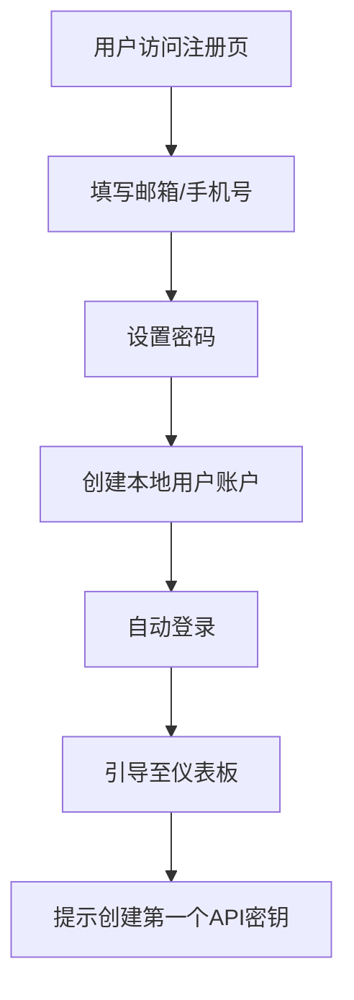
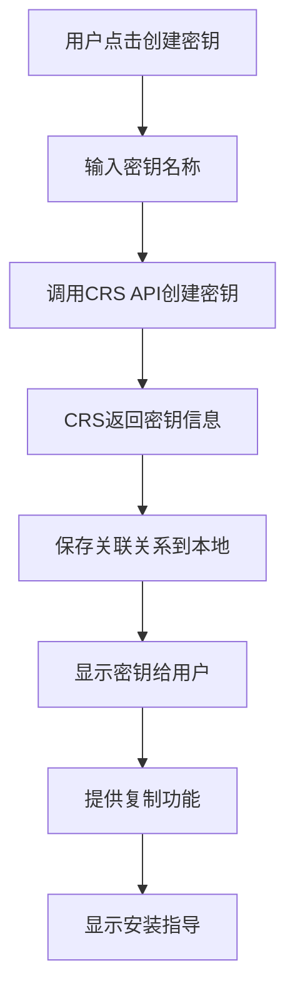

# Claude Key Portal - 修订版实现方案

## 一、项目定位重新明确

### 核心理念
**不重复造轮子，专注用户体验**

我们的项目是CRS的**用户端门户**，通过调用CRS现有API来提供：
1. 用户自助注册和管理
2. API密钥的生成和管理（通过CRS API）
3. 友好的安装指导
4. 使用统计展示（从CRS获取）

### 系统关系图
```
┌─────────────────────────────────────────────────────┐
│                     用户浏览器                        │
└──────────────────┬──────────────────────────────────┘
                   │
┌──────────────────▼──────────────────────────────────┐
│           Claude Key Portal (我们的项目)              │
│  ┌────────────────────────────────────────────┐     │
│  │  前端：用户界面、安装指导、密钥管理界面      │     │
│  └────────────────────────────────────────────┘     │
│  ┌────────────────────────────────────────────┐     │
│  │  后端：用户认证、代理CRS API、数据缓存      │     │
│  └────────────────────────────────────────────┘     │
└──────────────────┬──────────────────────────────────┘
                   │ API调用
┌──────────────────▼──────────────────────────────────┐
│                CRS (已部署的中继服务)                  │
│         https://claude.just-play.fun                │
│  ┌────────────────────────────────────────────┐     │
│  │  核心功能：API密钥生成、使用统计、代理转发   │     │
│  └────────────────────────────────────────────┘     │
└──────────────────────────────────────────────────────┘
```

## 二、简化后的功能模块

### 1. 用户系统（独立实现）
```typescript
interface UserSystem {
  // 本地用户管理
  features: [
    "用户注册（邮箱/手机号）",
    "用户登录（JWT认证）",
    "密码重置",
    "个人信息管理",
    "用户与CRS密钥关联"
  ];

  // 用户模型
  userModel: {
    id: string;
    email?: string;
    phone?: string;
    password: string;
    crsApiKey?: string;  // 关联的CRS管理员密钥
    createdAt: Date;
    updatedAt: Date;
  };
}
```

### 2. API密钥管理（调用CRS API）
```typescript
interface ApiKeyManagement {
  // 通过CRS API管理密钥
  operations: {
    listKeys: () => "GET /admin/api/keys",
    createKey: () => "POST /admin/api/keys",
    deleteKey: () => "DELETE /admin/api/keys/:id",
    getStats: () => "GET /admin/api/keys/:id/stats"
  };

  // 本地只存储关联关系
  localData: {
    userId: string;
    crsKeyId: string;
    keyName: string;
    createdAt: Date;
  };
}
```

### 3. 安装指导系统（纯前端）
```typescript
interface InstallationGuide {
  // 静态内容 + 动态脚本生成
  features: [
    "分平台安装教程",
    "一键生成配置脚本",
    "环境检测工具下载",
    "视频教程嵌入",
    "常见问题FAQ"
  ];

  // 脚本生成器
  scriptGenerator: {
    input: { platform: string; apiKey: string; },
    output: string; // 定制化安装脚本
  };
}
```

### 4. 使用统计展示（从CRS获取）
```typescript
interface UsageStatistics {
  // 调用CRS统计API
  dataSource: {
    getDashboard: () => "GET /admin/api/dashboard",
    getKeyStats: () => "GET /admin/api/keys/:id/stats",
    getUsageTrend: () => "GET /admin/api/stats/trend"
  };

  // 前端展示
  display: [
    "今日请求量",
    "Token消耗",
    "使用趋势图表",
    "模型分布"
  ];
}
```

## 三、简化的技术架构

### 前端（Next.js）
```typescript
// 页面结构
const pages = {
  "/": "首页介绍",
  "/register": "用户注册",
  "/login": "用户登录",
  "/dashboard": "用户仪表板",
  "/dashboard/keys": "密钥管理",
  "/dashboard/usage": "使用统计",
  "/install": "安装指导",
  "/install/[platform]": "分平台教程"
};

// 核心组件
const components = {
  KeyCard: "密钥展示卡片",
  UsageChart: "使用统计图表",
  InstallScript: "脚本生成器",
  PlatformGuide: "平台教程"
};
```

### 后端（Express）
```typescript
// API路由
const routes = {
  // 用户认证（本地）
  "POST /api/auth/register": "用户注册",
  "POST /api/auth/login": "用户登录",
  "POST /api/auth/refresh": "刷新Token",

  // CRS代理（转发请求）
  "GET /api/keys": "获取密钥列表",
  "POST /api/keys": "创建新密钥",
  "DELETE /api/keys/:id": "删除密钥",
  "GET /api/stats": "获取统计数据",

  // 工具接口
  "GET /api/script": "生成安装脚本",
  "GET /api/check": "环境检测"
};
```

### 数据库（简化设计）
```prisma
// 只存储用户信息和关联关系
model User {
  id        String   @id @default(uuid())
  email     String?  @unique
  phone     String?  @unique
  password  String

  // CRS关联
  crsToken  String?  // CRS管理员Token

  createdAt DateTime @default(now())
  updatedAt DateTime @updatedAt

  keys      UserKey[]
}

model UserKey {
  id        String   @id @default(uuid())
  userId    String
  crsKeyId  String   // CRS中的密钥ID
  name      String
  lastUsed  DateTime?

  user      User     @relation(fields: [userId], references: [id])

  @@index([userId])
  @@index([crsKeyId])
}
```

## 四、CRS API对接方案

### 1. 认证方式
```typescript
class CRSClient {
  private baseUrl = 'https://claude.just-play.fun';
  private adminToken: string; // 管理员Token

  constructor(token: string) {
    this.adminToken = token;
  }

  // 所有请求带上认证头
  private getHeaders() {
    return {
      'Authorization': `Bearer ${this.adminToken}`,
      'Content-Type': 'application/json'
    };
  }
}
```

### 2. 核心API封装
```typescript
class CRSApiService {
  // 密钥管理
  async createApiKey(name: string, tags: string[]) {
    return await this.client.post('/admin/api/keys', {
      name,
      tags,
      quota: -1 // 无限额度
    });
  }

  async listApiKeys() {
    return await this.client.get('/admin/api/keys');
  }

  async deleteApiKey(keyId: string) {
    return await this.client.delete(`/admin/api/keys/${keyId}`);
  }

  // 统计数据
  async getKeyStatistics(keyId: string) {
    return await this.client.get(`/admin/api/keys/${keyId}/stats`);
  }

  async getDashboardData() {
    return await this.client.get('/admin/api/dashboard');
  }
}
```

### 3. 数据缓存策略
```typescript
class CacheService {
  // 使用Redis缓存CRS数据
  async getCachedStats(keyId: string) {
    const cached = await redis.get(`stats:${keyId}`);
    if (cached) return JSON.parse(cached);

    // 缓存未命中，从CRS获取
    const stats = await crsApi.getKeyStatistics(keyId);
    await redis.setex(`stats:${keyId}`, 300, JSON.stringify(stats)); // 5分钟缓存
    return stats;
  }
}
```

## 五、核心功能实现细节

### 1. 用户注册流程


### 2. API密钥创建流程


### 3. 安装脚本生成
```typescript
function generateInstallScript(platform: string, apiKey: string): string {
  const crsUrl = 'https://claude.just-play.fun/api';

  const templates = {
    windows: `
# Windows PowerShell 安装脚本
# 1. 检查Node.js
if (!(Get-Command node -ErrorAction SilentlyContinue)) {
    Write-Host "请先安装Node.js: https://nodejs.org"
    exit 1
}

# 2. 安装Claude Code
npm install -g @anthropic-ai/claude-code

# 3. 设置环境变量
[System.Environment]::SetEnvironmentVariable("ANTHROPIC_BASE_URL", "${crsUrl}", "User")
[System.Environment]::SetEnvironmentVariable("ANTHROPIC_AUTH_TOKEN", "${apiKey}", "User")

Write-Host "✅ 安装完成！请重启终端后运行 'claude' 命令"
`,
    macos: `
#!/bin/bash
# macOS 安装脚本

# 1. 检查并安装Node.js
if ! command -v node &> /dev/null; then
    echo "正在安装Node.js..."
    brew install node || {
        echo "请安装Homebrew或手动安装Node.js"
        exit 1
    }
fi

# 2. 安装Claude Code
npm install -g @anthropic-ai/claude-code

# 3. 配置环境变量
echo 'export ANTHROPIC_BASE_URL="${crsUrl}"' >> ~/.zshrc
echo 'export ANTHROPIC_AUTH_TOKEN="${apiKey}"' >> ~/.zshrc
source ~/.zshrc

echo "✅ 安装完成！请运行 'claude' 命令开始使用"
`,
    linux: `
#!/bin/bash
# Linux 安装脚本

# 1. 检查Node.js
if ! command -v node &> /dev/null; then
    echo "请先安装Node.js:"
    echo "  Ubuntu/Debian: sudo apt-get install nodejs npm"
    echo "  CentOS/RHEL: sudo yum install nodejs npm"
    exit 1
fi

# 2. 安装Claude Code
sudo npm install -g @anthropic-ai/claude-code

# 3. 配置环境变量
echo 'export ANTHROPIC_BASE_URL="${crsUrl}"' >> ~/.bashrc
echo 'export ANTHROPIC_AUTH_TOKEN="${apiKey}"' >> ~/.bashrc
source ~/.bashrc

echo "✅ 安装完成！请运行 'claude' 命令开始使用"
`
  };

  return templates[platform] || templates.linux;
}
```

## 六、简化的开发计划

### Sprint 1: 基础架构（Day 1-2）
- [x] 项目初始化（Next.js + Express）
- [x] 数据库配置（PostgreSQL + Prisma）
- [x] 基础路由和页面结构
- [x] UI组件库配置（Shadcn/ui）

### Sprint 2: 用户系统（Day 3-4）
- [ ] 注册/登录页面
- [ ] JWT认证实现
- [ ] 用户仪表板框架
- [ ] 个人信息管理

### Sprint 3: CRS集成（Day 5-6）
- [ ] CRS API客户端封装
- [ ] 密钥管理功能
  - [ ] 创建密钥
  - [ ] 密钥列表
  - [ ] 删除密钥
- [ ] 统计数据展示
  - [ ] 使用量统计
  - [ ] 请求趋势图表

### Sprint 4: 安装指导（Day 7）
- [ ] 分平台教程页面
- [ ] 脚本生成器
- [ ] 一键复制功能
- [ ] 环境检测工具

### Sprint 5: 优化部署（Day 8）
- [ ] 响应式优化
- [ ] 性能优化
- [ ] 部署配置
- [ ] 测试和修复

## 七、关键接口设计

### 1. 前端API调用
```typescript
// hooks/useApi.ts
export function useKeys() {
  return useQuery(['keys'], async () => {
    const res = await fetch('/api/keys');
    return res.json();
  });
}

export function useCreateKey() {
  return useMutation(async (data: CreateKeyDto) => {
    const res = await fetch('/api/keys', {
      method: 'POST',
      body: JSON.stringify(data)
    });
    return res.json();
  });
}

export function useStats(keyId: string) {
  return useQuery(['stats', keyId], async () => {
    const res = await fetch(`/api/stats?keyId=${keyId}`);
    return res.json();
  });
}
```

### 2. 后端路由实现
```typescript
// routes/keys.ts
router.get('/keys', authenticate, async (req, res) => {
  try {
    // 从CRS获取用户的密钥
    const keys = await crsClient.listApiKeys();

    // 过滤出属于当前用户的密钥
    const userKeys = await prisma.userKey.findMany({
      where: { userId: req.user.id }
    });

    const filteredKeys = keys.filter(key =>
      userKeys.some(uk => uk.crsKeyId === key.id)
    );

    res.json(filteredKeys);
  } catch (error) {
    res.status(500).json({ error: 'Failed to fetch keys' });
  }
});

router.post('/keys', authenticate, async (req, res) => {
  try {
    const { name } = req.body;

    // 在CRS创建密钥
    const crsKey = await crsClient.createApiKey(name, ['user-created']);

    // 保存关联关系
    await prisma.userKey.create({
      data: {
        userId: req.user.id,
        crsKeyId: crsKey.id,
        name: crsKey.name
      }
    });

    res.json(crsKey);
  } catch (error) {
    res.status(500).json({ error: 'Failed to create key' });
  }
});
```

## 八、部署架构（简化版）

### 使用VPS + Caddy部署
```caddy
# Caddyfile
your-domain.com {
  # 前端静态文件
  handle /static/* {
    root * /var/www/claude-portal/frontend/.next/static
    file_server
  }

  # API代理
  handle /api/* {
    reverse_proxy localhost:4000
  }

  # Next.js SSR
  handle {
    reverse_proxy localhost:3000
  }
}
```

### Docker Compose配置
```yaml
version: '3.8'

services:
  frontend:
    build: ./frontend
    ports:
      - "3000:3000"
    environment:
      - NEXT_PUBLIC_API_URL=http://backend:4000
    depends_on:
      - backend

  backend:
    build: ./backend
    ports:
      - "4000:4000"
    environment:
      - DATABASE_URL=postgresql://user:pass@db:5432/claude_portal
      - CRS_API_URL=https://claude.just-play.fun
      - CRS_ADMIN_TOKEN=${CRS_ADMIN_TOKEN}
    depends_on:
      - db
      - redis

  db:
    image: postgres:14
    environment:
      - POSTGRES_DB=claude_portal
      - POSTGRES_USER=user
      - POSTGRES_PASSWORD=pass
    volumes:
      - postgres_data:/var/lib/postgresql/data

  redis:
    image: redis:6
    volumes:
      - redis_data:/data

volumes:
  postgres_data:
  redis_data:
```

## 九、成本效益分析

### 开发成本降低
- ❌ ~~不需要开发积分系统~~ ✅ 使用CRS现有功能
- ❌ ~~不需要开发代理转发~~ ✅ 直接调用CRS API
- ❌ ~~不需要管理Claude账号~~ ✅ CRS已实现

### 维护成本降低
- 核心功能由CRS负责维护
- 我们只维护用户界面和体验
- 问题定位清晰，责任边界明确

### 用户价值提升
- ✅ 自助注册，降低使用门槛
- ✅ 友好界面，提升用户体验
- ✅ 一键安装，简化配置流程
- ✅ 统计可视化，数据一目了然

## 十、风险控制

### 技术风险
1. **CRS API变更** → 建立版本适配层
2. **性能瓶颈** → Redis缓存 + CDN加速
3. **安全漏洞** → 定期安全审计

### 运营风险
1. **CRS服务中断** → 友好的错误提示
2. **用户增长过快** → 预留扩展能力
3. **恶意使用** → Rate Limiting保护

## 总结

通过直接使用CRS现有功能，我们的项目变得更加简洁和专注：

1. **专注用户体验** - 不重复造轮子
2. **快速上线** - 开发周期缩短至8天
3. **易于维护** - 代码量少，逻辑清晰
4. **成本可控** - 减少服务器和维护成本

这个方案让我们能够快速交付一个实用的产品，同时保持未来扩展的灵活性。

---

更新时间: 2025-01-01
版本: v2.0.0