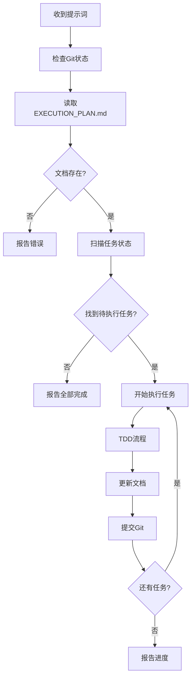

# 继续执行重组工作 - 通用提示词

> **用途**: 在新的对话窗口中复制此提示词，让Claude自动检查并继续执行工作
> **特点**: 通用型，无需修改，Claude会自动检测所有状态

---

## 🎯 通用提示词（推荐）⭐

**直接复制使用，无需修改任何内容**：

```
继续 Claude Key Portal 项目的 DDD Lite 架构重组工作。

项目路径: /Users/bypasser/claude-project/0930/claude-key-portal

请你：
1. 检查当前Git分支和状态
2. 读取 docs/EXECUTION_PLAN.md 了解执行计划
3. 检查当前进度（哪些Phase已完成，下一步是什么）
4. 继续执行下一个待完成的任务
5. 严格遵循TDD流程 (🔴 RED → 🟢 GREEN → 🔵 REFACTOR)
6. 每完成一个任务立即更新 docs/EXECUTION_PLAN.md

如果发现计划文档不存在或已完成所有工作，请告诉我当前状态。

开始吧！
```

---

## 🔍 Claude会自动做什么

收到上述提示词后，Claude会依次执行：

### 1. 环境检查
```bash
✅ git branch              # 检查当前分支
✅ git status              # 检查工作区状态
✅ ls docs/                # 确认文档存在
```

### 2. 读取执行计划
```bash
✅ Read: docs/EXECUTION_PLAN.md      # 主执行计划
✅ Read: NEXT_STEPS.md (可选)        # 快速参考
```

### 3. 分析进度
```
✅ 扫描文档中的状态标记
   - ✅ 完成 = 已完成
   - 🟢 进行中 = 当前正在做
   - 🔴 待开始 = 下一步
   - ⏸️ 阻塞 = 有依赖

✅ 找到第一个 🔴 待开始 的任务
```

### 4. 继续执行
```
✅ 按照TDD流程执行任务
✅ 更新文档状态
✅ 提交Git
```

---

## 📋 预期对话流程示例

### 示例 1: 正常继续执行

**你**: (复制通用提示词)

**Claude**:
```
✅ 环境检查完成
   - 当前分支: feature/project-structure-cleanup
   - 工作区: 干净

✅ 已读取执行计划文档

📊 当前进度:
   - Phase 0-1: ✅ 完成 (20%)
   - Phase 2.1: 🔴 待开始 (持久化层)

🚀 下一步任务:
   - [ ] 移动 Prisma 文件
   - [ ] 创建 UserRepository 测试
   - [ ] 实现 UserRepository

开始执行 Phase 2.1 持久化层迁移...
```

### 示例 2: 发现部分任务已完成

**Claude**:
```
✅ 环境检查完成

📊 当前进度:
   - Phase 0-2.1: ✅ 完成 (35%)
   - Phase 2.2: 🟢 进行中 (认证服务)
   - 当前任务: PasswordService 实现到一半

🔍 检测到未完成的工作，继续执行...
```

### 示例 3: 全部完成

**Claude**:
```
✅ 环境检查完成

🎉 所有Phase已完成！(100%)

建议：
- 运行最终验收测试
- 创建PR合并到develop分支
- 更新主项目文档
```

---

## 💡 其他常用提示词

### 1️⃣ 只检查进度，不执行任务

```
检查 Claude Key Portal 项目的 DDD Lite 重组进度。

项目路径: /Users/bypasser/claude-project/0930/claude-key-portal

请你：
1. 检查当前Git分支
2. 读取 docs/EXECUTION_PLAN.md
3. 告诉我当前进度和下一步任务
4. 预估剩余工作量

只报告，不要开始执行。
```

### 2️⃣ 更新进度文档

```
更新 Claude Key Portal 项目的执行计划文档。

项目路径: /Users/bypasser/claude-project/0930/claude-key-portal

我已手动完成了以下工作：
- [具体描述你完成的任务]

请你：
1. 读取 docs/EXECUTION_PLAN.md
2. 找到对应的任务
3. 更新状态为 ✅
4. 重新计算完成度百分比
5. 提交Git
```

### 3️⃣ 从指定Phase开始

```
继续 Claude Key Portal 项目的 DDD Lite 重组工作。

项目路径: /Users/bypasser/claude-project/0930/claude-key-portal

请从 Phase 3（应用层）开始执行，跳过之前的Phase。

其他要求同标准流程。
```

### 4️⃣ 修复某个失败的任务

```
修复 Claude Key Portal 项目重组中的失败任务。

项目路径: /Users/bypasser/claude-project/0930/claude-key-portal

Phase 2.1 的 UserRepository 测试失败了，错误信息：
[粘贴错误信息]

请你：
1. 分析错误原因
2. 修复问题
3. 确保测试通过
4. 更新文档状态
```

### 5️⃣ 生成进度报告

```
生成 Claude Key Portal 项目的进度报告。

项目路径: /Users/bypasser/claude-project/0930/claude-key-portal

请你：
1. 读取 docs/EXECUTION_PLAN.md
2. 生成一份详细的进度报告，包括：
   - 已完成的工作
   - 当前进行中的任务
   - 待完成的任务
   - 遇到的问题
   - 预计完成时间

输出为Markdown格式。
```

---

## 🎓 高级用法

### 智能恢复（推荐）⭐

Claude会自动检测上下文，无需你指定：

```
继续重组工作。

项目: /Users/bypasser/claude-project/0930/claude-key-portal

自动检测并继续。
```

**极简版**（最短）：

```
继续 Claude Key Portal DDD 重组。

路径: /Users/bypasser/claude-project/0930/claude-key-portal

自动继续。
```

### 并行执行多个任务

```
继续 Claude Key Portal 项目的重组工作。

项目路径: /Users/bypasser/claude-project/0930/claude-key-portal

如果下一步任务可以并行执行（例如多个独立的Repository），
请同时创建它们的测试和实现，提高效率。
```

### 紧急修复模式

```
紧急修复模式。

项目: /Users/bypasser/claude-project/0930/claude-key-portal

忽略执行计划，优先修复当前阻塞问题：
[描述问题]

修复后再回到正常流程。
```

---

## 📊 文档结构速查

```
claude-key-portal/
├── RESUME_PROMPT.md           # ⭐ 本文档（提示词模板）
├── NEXT_STEPS.md              # 快速参考指南
└── docs/
    ├── EXECUTION_PLAN.md      # ⭐⭐⭐ 主执行计划（进度跟踪）
    ├── CODE_REUSE_ANALYSIS.md # 代码复用分析
    ├── REFACTORING_PLAN.md    # 技术重组方案
    └── REFACTORING_SUMMARY.md # 工作总结
```

**重要**：
- `EXECUTION_PLAN.md` 是唯一的进度真相来源（Single Source of Truth）
- Claude会自动读取和更新这个文档
- 所有状态标记（✅🟢🔴⏸️）都在这个文档中

---

## ✅ 测试提示词

### 快速测试（30秒）

复制下面的测试提示词，验证Claude是否正确理解：

```
测试 Claude Key Portal 重组状态检测。

项目路径: /Users/bypasser/claude-project/0930/claude-key-portal

请检查当前进度并报告，不要执行任务。
```

**期望输出**：
```
✅ 当前分支: feature/project-structure-cleanup
✅ 已完成: Phase 0-1 (20%)
✅ 下一步: Phase 2.1 持久化层

准备就绪，等待开始指令。
```

---

## 🎯 最佳实践

### 每次对话开始时

1. **复制通用提示词**（页面顶部的⭐版本）
2. **发送给Claude**
3. **Claude自动检测并继续**
4. **定期查看 `EXECUTION_PLAN.md` 确认进度**

### 工作中断后恢复

```
继续 Claude Key Portal DDD 重组。
路径: /Users/bypasser/claude-project/0930/claude-key-portal
自动检测并继续上次的工作。
```

### 多人协作场景

```
继续 Claude Key Portal DDD 重组。
路径: /Users/bypasser/claude-project/0930/claude-key-portal

检查是否有其他人更新了代码（git pull），
然后继续执行计划中的任务。
```

---

## 🔄 自动化工作流

Claude收到通用提示词后的完整执行流程：



---

## 📞 常见问题

### Q: 如果文档不存在怎么办？

**A**: Claude会报告错误并询问是否需要创建新的执行计划。

### Q: 如果我手动修改了代码，需要告诉Claude吗？

**A**: 不需要，Claude会通过Git status自动检测。但建议更新文档。

### Q: 可以跳过某些Phase吗？

**A**: 可以，使用"从指定Phase开始"提示词。

### Q: 如何暂停执行？

**A**: 直接告诉Claude "暂停"或关闭对话即可。下次用通用提示词继续。

---

## 🎉 一键复制区

### 标准提示词（最常用）

```
继续 Claude Key Portal 项目的 DDD Lite 架构重组工作。

项目路径: /Users/bypasser/claude-project/0930/claude-key-portal

请你：
1. 检查当前Git分支和状态
2. 读取 docs/EXECUTION_PLAN.md 了解执行计划
3. 检查当前进度（哪些Phase已完成，下一步是什么）
4. 继续执行下一个待完成的任务
5. 严格遵循TDD流程 (🔴 RED → 🟢 GREEN → 🔵 REFACTOR)
6. 每完成一个任务立即更新 docs/EXECUTION_PLAN.md

如果发现计划文档不存在或已完成所有工作，请告诉我当前状态。

开始吧！
```

### 极简版（高级用户）

```
继续 Claude Key Portal DDD 重组。
路径: /Users/bypasser/claude-project/0930/claude-key-portal
自动继续。
```

---

**文档版本**: v2.0（通用版）
**创建时间**: 2025-10-06
**最后更新**: 2025-10-06
**适用场景**: 所有阶段，所有分支，任何进度

---

_"一个提示词，搞定所有场景！"_ ✨
